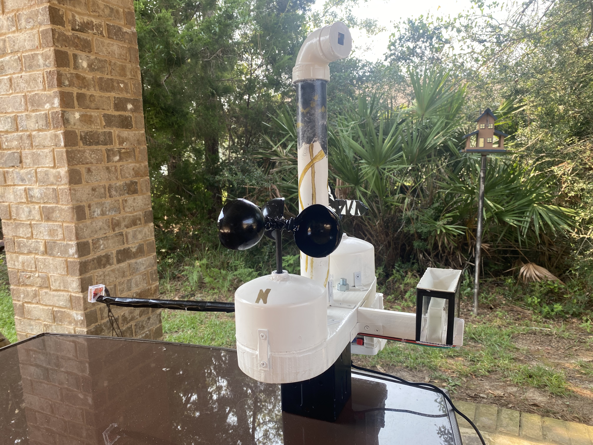

This code controls the PiWxStation, a Raspberry Pi-based weather station including a combination of custom-built and commercial sensors, all controlled with Python. The weather station is configured to sample conditions every 15 minutes, and data are stored locally in daily CSV files and uploaded (internet connectivity permitting) to a remote server (associated repository [here](www.github.com/cdens/wxserver) with an incorporated database. The following items are currently measured by the PiWx Station: temperature (&#176;F), relative humidity (%), pressure (mb), wind speed (mph), wind direction (&#176;T), rainfall rate (mm/hr), and lightning strike rate (per hour).

 
    
Temperature (&#176;F), relative humidity (%), and pressure (mb) are measured with a [BME 280](https://www.amazon.com/gp/product/B07P4CWGGK/ref=ppx_yo_dt_b_search_asin_title?ie=UTF8&psc=1)">BME 280</a> environmental sensor via I2C protocol. The sensor is located on the underside of the station where it is sheltered from sun and rain to provide the most accurate readings.
    
Wind speed is measured with a custom-built three-cupped anemometer. As winds spin the anemometer, magnets connected to the shaft pass a [Hall Effect sensor](https://www.amazon.com/gp/product/B07SGBW87J/ref=ppx_yo_dt_b_search_asin_title?ie=UTF8&psc=1), which increases the voltage on a line connected to a Raspberry Pi GPIO pin each time the magnet passes. The Pi counts the number of voltage changes on the line over a 30-second duration to calculate rotations per minute and from this value determines the wind speed.
    
Wind direction is measured with a custom built wind vane. A magnet attached to the shaft of the wind vane sits over one of eight [reed switches](https://www.amazon.com/gp/product/B07MLZHWLY/ref=ppx_yo_dt_b_search_asin_title?ie=UTF8&psc=1), which close a circuit when in the presence of a magnetic field and are otherwise open. The reed switches are connected to an [eight-channel analog to digital converter](https://www.amazon.com/gp/product/B01HGCSGXM/ref=ppx_yo_dt_b_search_asin_title?ie=UTF8&psc=1), which measures the voltage of each connection. The Pi receives these eight voltages and uses them to identify the position of the magnet and corresponding wind direction. 
    
Rainfall is measured with a custom built tipping bucket style rain gauge. This gauge funnels rain into a small two-chambered bucket balanced on a fulcrum. Each time a bucket fills (the gauge was designed for this to correspond to 1 mm of rainfall), the bucket tips and empties its water and the other bucket begins to fill. An attached magnet and an additional Hall Effect sensor enable the weather station to record each 1 mm of total rainfall and calculate rainfall rates.
    
Lightning is observed with a [Sparkfun AS3935 Lightning Detector](https://www.amazon.com/gp/product/B07WFKWGC8/ref=ppx_yo_dt_b_search_asin_title?ie=UTF8&psc=1). This sensor includes a small antenna which measures electromagnetic pulses (EMPs) produced by lightning strikes in the 500 kHz band and estimates distance from the lightning strike. The sensor is connected to the weather station via a 14" rod, which provides sufficient standoff distance from the Raspberry Pi and other sensors to prevent the detector from picking up false positives.
    
A tower in the center of the weather station provides a waterproof housing for the [5MP/1080p Raspberry Pi photo/video camera](https://www.amazon.com/gp/product/B07JPLV5K1/ref=ppx_yo_dt_b_search_asin_title?ie=UTF8&psc=1). The camera can be commanded remotely to capture videos, take individual photographs, or take time lapse videos with a customizable interval and duration (code included in this repository). The housing can be rotated 360&#176;, enabling the camera to document sunrises, sunsets, or storms and other weather phenomena in any direction. 
   